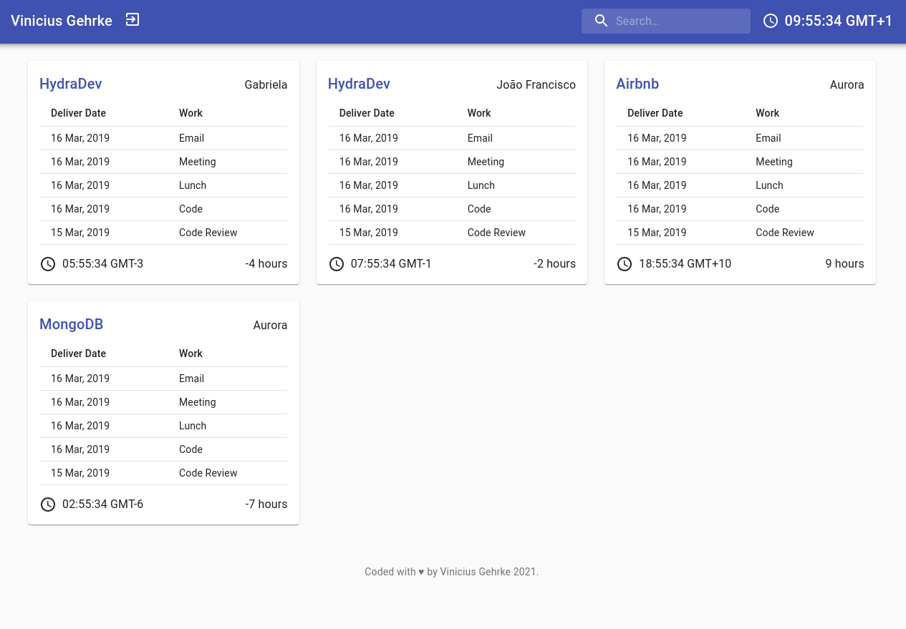
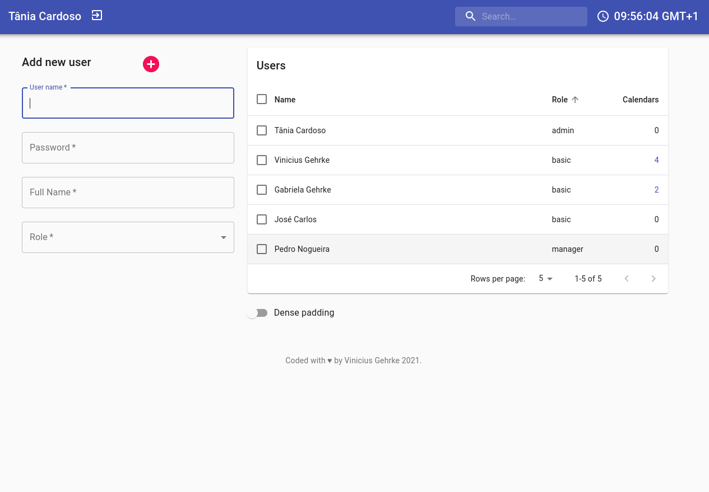

# Synchronized Calendars

  
  
  

## About this project

A web app that allows a user to see all their collaborators' calendars with their names, task list and associated time zone.

## Screenshots

## Features

- Signup and Login with cookie-based Authentication.
- Permissions according to users's role.
- CRUD operations with calendars and users (for admin role).
- Difference between local and calendar's time zone.
- Search filter by user or calendar's name.
- REST API end points using Next.JS API Routes.

## Available Scripts

In the project directory, you can run:

### `yarn dev`

### `yarn build`

### `yarn start`

## Live Site
You can check a live demo [here](https://sync-calendar.vercel.app/)

[OnPortfolio](https://front-end-portfolio.vercel.app/)
